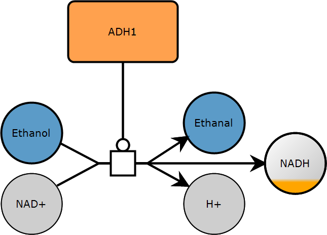

# Images

`libsbgnpy` does not draw maps itself. `render_sbgn` sends a document to the rendering web service of Frank Bergmann at <https://sbml.bioquant.uni-heidelberg.de/layout>, which lays it out and returns the image:

```python
from pathlib import Path

from libsbgnpy import read_sbgn_from_file, render_sbgn

sbgn = read_sbgn_from_file(Path("examples/sbgn/adh.sbgn"))
render_sbgn(sbgn, Path("adh.png"))
```



The request is equivalent to

```bash
curl -X POST -F file=@"map.sbgn" https://sbml.bioquant.uni-heidelberg.de/layout -o map.png
```

## Requirements and errors

Rendering needs an internet connection. The service is queried with a timeout of 60 seconds, `requests` raises a `RequestException` if it cannot be reached or answers with an error.

Only PNG is supported, and the image file has to end in `.png`; anything else raises a `ValueError` before the request is made.

## The layout comes from the document

The service draws the map at the coordinates the document carries, i.e., the `Bbox` of every glyph and the `start`, `end` and `next` points of every arc. It does not compute a layout, so a document without coordinates renders as an empty or a collapsed image. See [SBGN maps](maps.md#ports-and-arcs) for how the coordinates are set.

## Examples

| example | what it shows |
| --- | --- |
| [`ethanol.py`](https://github.com/matthiaskoenig/libsbgnpy/blob/develop/examples/ethanol.py) | build a map step by step and render it after every step |
