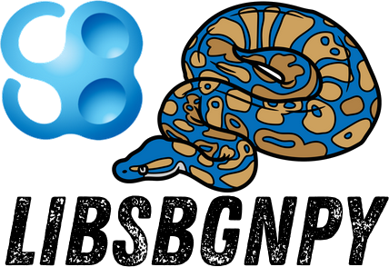

# libsbgnpy: python library for SBGN
[](https://github.com/matthiaskoenig/libsbgnpy/actions/workflows/ci-cd.yml) [](https://matthiaskoenig.github.io/libsbgnpy) [](https://pypi.org/project/libsbgnpy/) [](https://pypi.org/project/libsbgnpy/) [](https://opensource.org/licenses/MIT) [](https://doi.org/10.5281/zenodo.597155)

`libsbgnpy` is a python library to work with the [Systems Biology Graphical Notation (SBGN)](https://sbgn.github.io/). The source code is available from [https://github.com/matthiaskoenig/libsbgnpy](https://github.com/matthiaskoenig/libsbgnpy).

## Background

A pathway drawn by hand is a picture: a human sees what it means, a machine sees pixels. SBGN fixes this by defining what every shape in a biological map means ([Le Novère et al. 2009](https://doi.org/10.1038/nbt.1558)). A rounded rectangle is a macromolecule, a circle is a simple chemical, a square with two ports is a process, an arrow with a filled head is production. Three languages cover what is usually drawn:

- **Process Description (PD)** — what is converted into what, e.g., a metabolic or a signalling network,
- **Entity Relationship (ER)** — which entity influences which other entity, without ordering the events,
- **Activity Flow (AF)** — the flow of activity between the entities, the level of a cartoon in a review.

**SBGN-ML** is the exchange format of such a map ([van Iersel et al. 2012](https://doi.org/10.1186/1471-2105-13-S6-S12)): an XML document which stores the glyphs, the arcs between them, and the coordinates they are drawn at, so a map travels between the tools that draw it. `libsbgnpy` reads, writes, validates and renders these documents from python.

## Features

- **[SBGN maps](maps.md)** — the complete SBGN-ML schema as python classes, generated with [xsdata](https://github.com/tefra/xsdata): maps, glyphs, arcs, ports and bounding boxes, with the classes of the three languages as enums.
- **[Reading and writing](io.md)** — read and write SBGN-ML documents from files or strings; SBGN-ML 0.1 and 0.2 documents are upconverted while reading.
- **[Notes and extensions](extensions.md)** — the arbitrary XML which SBGN elements carry, written and read back as XML.
- **[Render information](render.md)** — colors, gradients and styles of a map, stored as an extension.
- **[Validation](validation.md)** — validation of a document against the SBGN XSD schema.
- **[Images](images.md)** — rendering of a map as a PNG through a web service.

## Quickstart

Read an SBGN document and walk over its content:

```python
from pathlib import Path

from libsbgnpy import read_sbgn_from_file

sbgn = read_sbgn_from_file(Path("examples/sbgn/adh.sbgn"))
map = sbgn.map[0]

print(map.language)
# MapLanguage.PROCESS_DESCRIPTION

for glyph in map.glyph:
    print(glyph.id, glyph.class_value, glyph.label.text if glyph.label else None)
    # glyph1 GlyphClass.SIMPLE_CHEMICAL Ethanol
```

Create a map from scratch, write it and render it:

```python
from pathlib import Path

from libsbgnpy import (
    Bbox,
    Glyph,
    GlyphClass,
    Label,
    Map,
    MapLanguage,
    Sbgn,
    render_sbgn,
    write_sbgn_to_file,
)

map = Map(
    id="ethanol",
    language=MapLanguage.PROCESS_DESCRIPTION,
    bbox=Bbox(x=0, y=0, w=363, h=253),
)
map.glyph.append(
    Glyph(
        id="ethanol",
        class_value=GlyphClass.SIMPLE_CHEMICAL,
        label=Label(text="Ethanol"),
        bbox=Bbox(x=40, y=120, w=60, h=60),
    )
)
sbgn = Sbgn(map=[map])

write_sbgn_to_file(sbgn, Path("ethanol.sbgn"))
render_sbgn(sbgn, Path("ethanol.png"))
```

The complete example, which builds the alcohol dehydrogenase reaction step by step, is [`examples/ethanol.py`](https://github.com/matthiaskoenig/libsbgnpy/blob/develop/examples/ethanol.py):


If you have any questions or issues please [open an issue](https://github.com/matthiaskoenig/libsbgnpy/issues).

# How to cite
[](https://doi.org/10.5281/zenodo.597155)

If you use `libsbgnpy` please cite the archived software on Zenodo. [10.5281/zenodo.597155](https://doi.org/10.5281/zenodo.597155) is the concept DOI, which always resolves to the latest version; the DOI below is the one of this release:

> König, M. (2026). *libsbgnpy: python library for SBGN* (Version 0.6.0) [Computer software]. Zenodo. https://doi.org/10.5281/zenodo.22641925

```bibtex
@software{konig_libsbgnpy,
  author    = {König, Matthias},
  title     = {libsbgnpy: python library for SBGN},
  year      = {2026},
  month     = {9},
  version   = {0.6.0},
  publisher = {Zenodo},
  doi       = {10.5281/zenodo.22641925},
  url       = {https://doi.org/10.5281/zenodo.22641925},
}
```

# License
- Source Code: [MIT](https://opensource.org/license/MIT)
- Documentation: [CC BY-SA 4.0](https://creativecommons.org/licenses/by-sa/4.0/)

# Funding
Matthias König (MK) was supported by the Federal Ministry of Education and Research (BMBF, Germany) within the research network Systems Medicine of the Liver (LiSyM, grant number 031L0054). MK is supported by the Federal Ministry of Education and Research (BMBF, Germany) within ATLAS by grant number 031L0304B and by the German Research Foundation (DFG) within the Research Unit Program FOR 5151 QuaLiPerF (Quantifying Liver Perfusion-Function Relationship in Complex Resection - A Systems Medicine Approach) by grant number 436883643 and by grant number 465194077 (Priority Programme SPP 2311, Subproject SimLivA).

© 2016-2026 Matthias König
