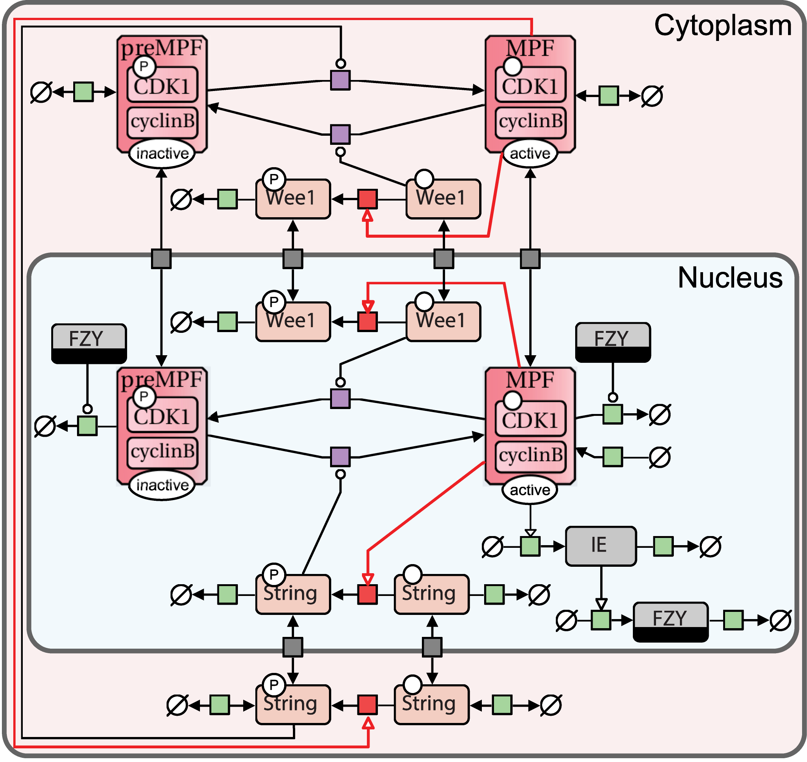
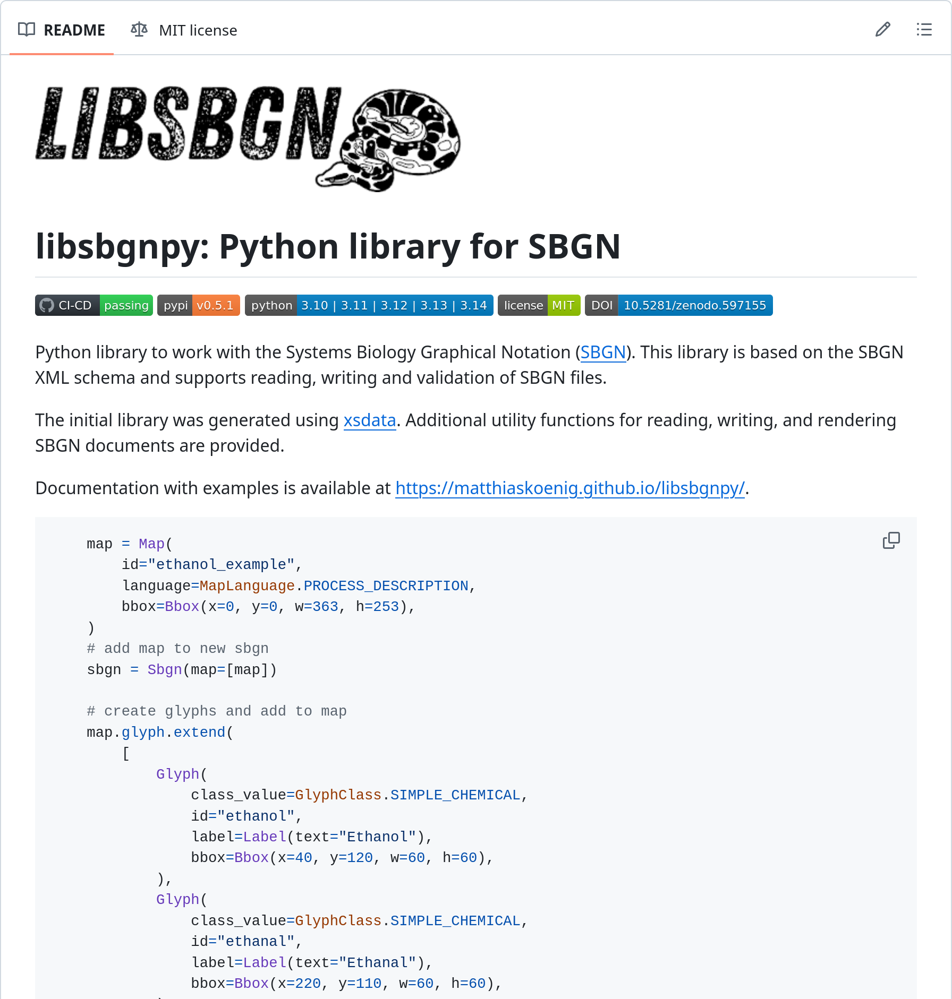
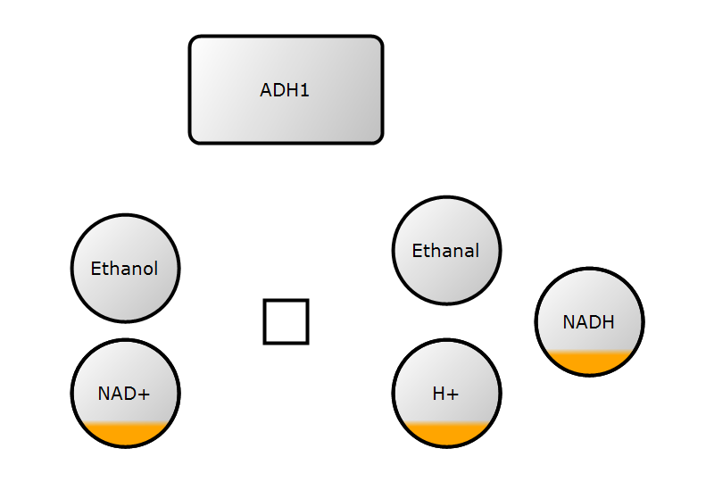
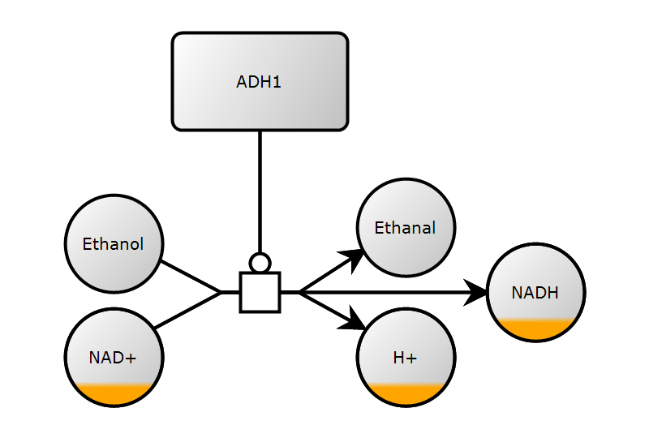
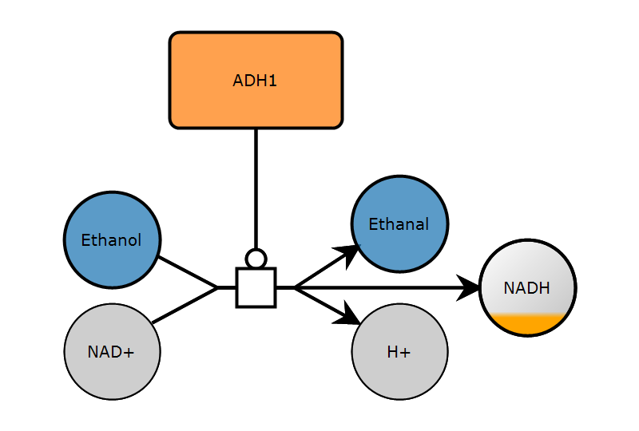
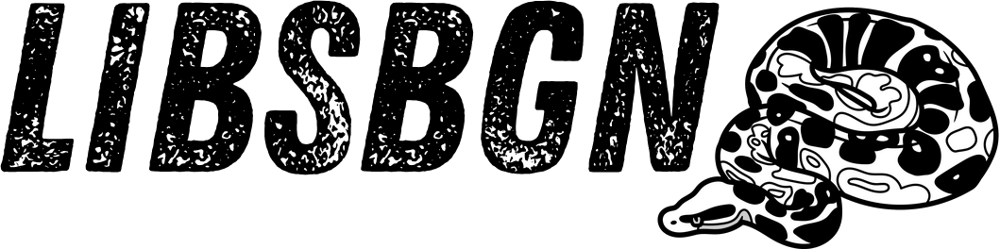

## SBGN {.smaller}

:::: {.columns}

::: {.column width="50%"}
- **Systems Biology Graphical Notation**^[@LeNovere2009, @Bergmann2020, @vanIersel2012]
- Standardise graphical notation used in maps of biological processes
- **Process Description (PD)**^[@Rougny2019]: temporal courses of biochemical interactions in a network
- **Entity Relationship (ER)**^[@Sorokin2015]: all relationships between participates, regardless of the temporal aspects
- **Activity Flow (AF)**^[@Mi2015]: flow of information between biochemical entities in a network

<!-- {width: 50%} -->

:::

::: {.column width="50%"}

:::

::::

## libsbgnpy {.smaller}

:::: {.columns}

::: {.column width="50%"}
- Python library for SBGN^[@libsbgnpy-v0.5.2]
- Supports AF, PD, ER
- Supports libsbgn/0.3
- **new**: xsdata v26.1 dataclasses (stricter validation)
- **new**: py3.10 - py3.14 support
- **new**: better documentation: <https://matthiaskoenig.github.io/libsbgnpy/>


:::

::: {.column width="50%"}

:::

::::

## 1. Create map {auto-animate="true"}

```python
"""Ethanol example."""
# create new map
map = Map(
    language=MapLanguage.PROCESS_DESCRIPTION,
    bbox=Bbox(x=0, y=0, w=363, h=253),
)
# add map to new sbgn
sbgn = Sbgn(map=[map])
```

## 2. Add glyphs

```python
"""Ethanol example."""
map.glyph.extend([
    Glyph(
        class_value=GlyphClass.SIMPLE_CHEMICAL,
        id="ethanol",
        label=Label(text="Ethanol"),
        bbox=Bbox(x=40, y=120, w=60, h=60),
    ),
    Glyph(
        class_value=GlyphClass.SIMPLE_CHEMICAL,
        id="ethanal",
        label=Label(text="Ethanal"),
        bbox=Bbox(x=220, y=110, w=60, h=60),
    ),
    Glyph(
        class_value=GlyphClass.MACROMOLECULE,
        id="adh1",
        label=Label(text="ADH1"),
        bbox=Bbox(x=106, y=20, w=108, h=60),
    ),
    Glyph(
        class_value=GlyphClass.SIMPLE_CHEMICAL,
        id="h",
        label=Label(text="H+"),
        bbox=Bbox(x=220, y=190, w=60, h=60),
        clone=Glyph.Clone(),
    ),
    Glyph(
        class_value=GlyphClass.SIMPLE_CHEMICAL,
        id="nad",
        label=Label(text="NAD+"),
        bbox=Bbox(x=40, y=190, w=60, h=60),
        clone=Glyph.Clone(),
    ),
    Glyph(
        class_value=GlyphClass.SIMPLE_CHEMICAL,
        id="glyph_nadh",
        label=Label(text="NADH"),
        bbox=Bbox(x=300, y=150, w=60, h=60),
        clone=Glyph.Clone(),
    ),
    # glyph with ports (process)
    Glyph(
        class_value=GlyphClass.PROCESS,
        id="pn1",
        orientation=GlyphOrientation.HORIZONTAL,
        bbox=Bbox(x=148, y=168, w=24, h=24),
        port=[
            Port(x=136, y=180, id="pn1.1"),
            Port(x=184, y=180, id="pn1.2"),
        ],
    ),
])
```

## 2. Add glyphs

{width=50%}

## 3. Add arcs
```python
"""Ethanol example."""
# create arcs and set the start and end points
map.arc.extend(
    [
        Arc(
            id="a01",
            class_value=ArcClass.CONSUMPTION,
            source="ethanol",
            target="pn1.1",
            start=Arc.Start(x=98, y=160),
            end=Arc.End(x=136, y=180),
        ),
        Arc(
            id="a02",
            class_value=ArcClass.PRODUCTION,
            source="pn1.2",
            target="nadh",
            start=Arc.Start(x=184, y=180),
            end=Arc.End(x=300, y=180),
        ),
        Arc(
            id="a03",
            class_value=ArcClass.CATALYSIS,
            source="adh1",
            target="pn1",
            start=Arc.Start(x=160, y=80),
            end=Arc.End(x=160, y=168),
        ),
        Arc(
            id="a04",
            class_value=ArcClass.PRODUCTION,
            source="pn1.2",
            target="h",
            start=Arc.Start(x=184, y=180),
            end=Arc.End(x=224, y=202),
        ),
        Arc(
            id="a05",
            class_value=ArcClass.PRODUCTION,
            source="pn1.2",
            target="ethanal",
            start=Arc.Start(x=184, y=180),
            end=Arc.End(x=224, y=154),
        ),
        Arc(
            id="a06",
            class_value=ArcClass.CONSUMPTION,
            source="nad",
            target="pn1.1",
            start=Arc.Start(x=95, y=202),
            end=Arc.End(x=136, y=180),
        ),
    ]
)
```

## 3. Add arcs

{width=50%}

## 4. Add render information
```python
render_info = RenderInformation(
    id="ethanol_render_info",
    program_name="libsbgnpy",
    program_version="0.4.0",
    list_of_color_definitions=ListOfColorDefinitions(
        color_definition=[
            ColorDefinition(id="blue", value="#1f77b4bb"),
            ColorDefinition(id="orange", value="#ff7f0ebb"),
            ColorDefinition(id="white", value="#000000"),
            ColorDefinition(id="grey", value="#cccccccc"),
            ColorDefinition(id="black", value="#ffffff"),
        ]
    ),
    list_of_gradient_definitions=ListOfGradientDefinitions(),
    list_of_styles=ListOfStyles(
        [
            Style(
                id_list="ethanol ethanal",
                g=G(stroke="black", stroke_width=2, fill="blue"),
            ),
            Style(
                id_list="adh1",
                g=G(stroke="black", stroke_width=2, fill="orange"),
            ),
            Style(
                id_list="nad nadh h",
                g=G(stroke="black", stroke_width=1, fill="grey"),
            ),
        ]
    ),
)
```

## 5. Save and render

:::: {.rows}

::: {.row height="60%"}
```python
# serialize to string
xml_str: str =  write_sbgn_to_string(sbgn)

# serialize to file
write_sbgn_to_file(sbgn, "ethanol_example.sbgn")

# render SBGN
render_sbgn(sbgn, "ethanol_example.png")
```
:::

::: {.row height="40%"}
{width=40%}
:::

::::

## Want to know more
::: {style="text-align: center; margin-top: 0.5em"}
::: {.columns}
::: {.column width="50%"}
[{.fixed-img}](https://matthiaskoenig.github.io/libsbgnpy)
:::

::: {.column width="25%"}
[{.fixed-img}](https://livermetabolism.com)
:::
::: {.column width="25%"}
{.fixed-img}
:::

:::
:::

::: {style="text-align: center; margin-top: 0.5em"}
[libsbgnpy documentation](https://matthiaskoenig.github.io/libsbgnpy/){preview-link="true" style="text-align: center"}
:::

<!-- # References-->
::: {#refs}
:::
